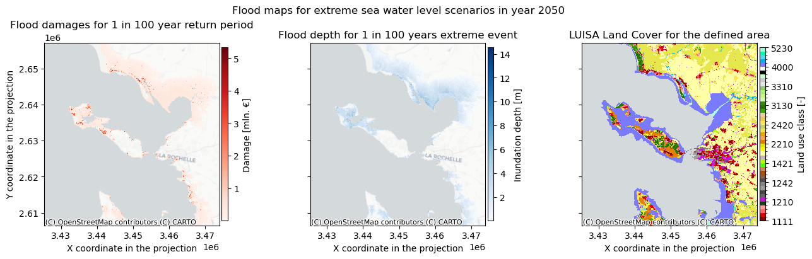

# Introduction to risk assessment for coastal flooding

## The causes of coastal flooding

Coastal flooding is one of the most damaging hazards in coastal areas. Coastal flood risk is expected to increase under the pressures of sea level rise (SLR), climate change and growth of population in coastal regions. A good understanding of which areas are prone to coastal flooding, and how this may change in the future will be instrumental in identifying appropriate mitigation and adaptation strategies.

Coastal flooding can be caused by high coastal water levels, driven by tide and storm surges, and further increased by sea level rise. Storm surges in particular can very greatly depending on the atmospheric conditions. Storm surge is increased when wind pushes the ocean water towards the land resulting in elevated water levels.

```{figure} ../images/Coastal_flood_illustration_storm_surge_NOAA_MetOffice.jpg
:name: stormsurge

Illustration of extreme water levels and storm surge. Credits: NOAA, MetOffice
```

## Risk assessment methodology

### How is risk calculated?
The risks from coastal flooding can be assessed by analyzing extreme water levels at the coast, constructing flood maps for extreme events with different return periods, and subsequently perfoming risk analysis on these flood maps to determine damages, exposed population or infrastructure, etc. In this toolbox we will demonstrate an example of a risk analysis for coastal flooding caused by extreme sea water levels using openly available global and European-scale datasets. We will focus in particular on assessing risk by calculating potential economic damage from coastal flooding to built infrastructure.

First, we can understand the variability of water levels and the range of extreme water levels by using data from global models and checking the data for the specific location of interest. We can also retrieve the latest sea level rise predictions to understand the expected changes to mean sea levels in the coming decades. These estimates of extreme water levels and sea level rise can be used to construct flood maps, by combining water level data and coastal topography data - this is done with the aid of flood models. In this toolbox we will use already exisiting coastal flood maps (see sections below for more details).

**The flood risk is calculated by combining maps of potential coastal flood extent with exposure and vulnerability data in the form of economic damage functions for infrastructure.** In particular, flood damage is calculated by applying damage curves to the flood inundation depth maps, taking into account the local situation. For each grid point, the damage is calculated based on the flood depth, land use type, damage curves, and country-specific parameters (can be defined by the user) that approximate the economic value of different land use types. The methodology for using vulnerability curves to estimate economic damage is described in more detail in the section on [Working with vulnerability curves](https://handbook.climaax.eu/resources/FAQ/vulnerability_curves.html).

The resulting data and maps help the user in identifying hotspots of potential economic damage due to coastal flooding for different return periods of extreme sea levels, and estimating the impact of future climate change scenarios on the flood risk.

### Which flood maps to use?
In this risk workflow, we use the Global Flood Maps dataset available via the ([Microsoft Planetary Computer](https://planetarycomputer.microsoft.com/dataset/deltares-floods)). This global dataset estimates flood maps for global coastlines based on extreme water level estimates for different return periods (e.g. 100 years). The flood maps are available for two climates: present-day climate (ca. 2018) and 2050 (RCP8.5 climate scenario). For each climate, different return periods of the extreme conditions are considered.

Please note that the underlying flood map dataset does not include coastal flood defences that may already be in place. It is important to always check the result against existing local knowledge of the infrastructure. More information on the applicability of the dataset is found below.

```{admonition} Global Flood Maps dataset and its applicability for local risk assessment
:class: hint dropdown
The Global Flood Maps dataset was developed by Deltares based on global modelling of water levels that are affected by tides, storm surges and sea level rise. In this dataset, maps for the present climate (ca. 2018) and future climate (ca. 2050) are available, with extreme water levels corresponding to return periods of 2, 5, 10, 25, 50, 100 and 250 years. The 2050 scenario assumes sea level rise as estimated under RCP8.5 (high-emission scenario). The flood maps have a resolution of 3 arcseconds (30-75 m in Europe depending on latitude).

The methodology behind this dataset is documented and can be accessed on the ([data portal](https://planetarycomputer.microsoft.com/dataset/deltares-floods)). The dataset is based on the GTSMv3.0 (Global Tide and Surge model), forced with ERA5 reanalysis atmospheric dataset. Statistical analysis of modelled data is used to arrive at extreme water level values for different return periods. These values are used to calculate flood depths by applying a static inundation modelling routine ("bathtub" method, with a simplified correction for friction over land) over a high-resolution Digital Elevation Model (MERIT-DEM or NASADEM). 

Several things to take into account when interpreting the flood maps:
 - This dataset helps to understand the **coastal flood potential** at a given location. The flood modelling in this dataset does not account for man-made coastal protections that may already be in place in populated regions (e.g. dams, and storm barriers). Therefore, it is always important to survey the local circumstances when interpreting flood maps.
 - The resolution of this global dataset is very high when considered on a global scale. However, for local areas with complex bathymetries the performance of the models is likely reduced (e.g. in estuaries or semi-enclosed bays) and the results should be treated with caution.
 - The dataset is based on a static topography. In some coastal areas, flood risk may be increased by land subsidence. If this is a known issue in the area of interest, it should be taken into account when interpreting the coastal flood maps.

For a more accurate estimate of coastal flood risks, it is recommended to perform local flood modelling, taking the results of the global model as boundary conditions. Local models can take better account of complex bathymetry and topography, and incorporate local data and knowledge about e.g. flood protection measures.
```

We use the Global Flood Maps dataset because of its wide spatial coverage and availability of a future climate scenario. Next to that, a next version of this dataset is under development and a more accurate version of the flood map will likely be available in the near future. However, for some locations with highly developed coastline this dataset may not be suitable for the analysis. Regional flood maps can also be used to perform a similar risk analysis to increase confidence in the results. 

## Description of the coastal flood map workflow 

### Scripts included in the workflow
The workflow example that is provided in this toolbox follows three steps, each of which is realized through a separate Jupyter notebook:

**Step 1:** Explore extreme water levels and sea level rise in the region of interest. 
In this step we retrieve the water level timeseries and statistics from a global database of water levels derived from GTSMv3.0. We also explore the sea level rise projections through the NASA Sea Level Projection Tool. Though this data will not be used for calculating risk, it can help the user to understand better the changes in water levels at their location and better interpret the flood maps. It can also allow to explore scenarios of sea level rise that are not included in the flood maps by getting an estimate of sea level rise and comparing between scenarios.    
**Notebook:** *Hazard_assessment_FLOOD_COASTAL_waterlevel.ipynb*)  

**Step 2:** Hazard assessment of coastal flooding using global flood maps.
In this step we retrieve the coastal flood maps for different return periods and scenarios from the Global Flood Maps dataset. This notebook enables the user to download the data, crop it to the region of interest, and compare the flood maps for different return periods and scenarios to each other. This step should also help the user to assess whether the Global Flood Maps dataset is suitable for their location by comparing the flood maps with the local knowledge on the coastal structures and flood defences that might be in place and not included in the floodmaps.    
**Notebook:** *Hazard_assessment_FLOOD_COASTAL_floodmaps.ipynb*

**Step 3:** Risk assessment of potential coastal flooding damages based on flood maps.
In this step potential risk due to coastal flooding is calculated by combining flood maps and data on land use, economic value and vulnerability (damage curves). We use the Global Flood Maps data in this example. However, we encourage the user to use their own flood maps and adapt this workflow to their needs to achieve higher accuracy of the results.    
**Notebook:** *Risk_assessment_FLOOD_COASTAL.ipynb*
  
### Datasets used in the workflow

The following datasets are used in this workflow:
- **Water level statistics:** global water level timeseries and statistical indicators are based on the Global Tide and Surge Model results (GTSMv3.0) forced with ERA5 reanalysis atmospheric data. This dataset is available from Copernicus Climate Change Service [here](https://cds.climate.copernicus.eu/datasets/sis-water-level-change-timeseries-cmip6).
- **Sea level rise:** sea level rise projections based on the 6th assessment of IPCC. We consult these projections on the [NASA Sea Level Projection Tool](https://sealevel.nasa.gov/data_tools/17). 
- **Flood maps:** Maps of flood depth (coastal inundation depth) are based on the Global Flood Maps dataset openly available via the Microsoft Planetary Computer ([source](https://planetarycomputer.microsoft.com/dataset/deltares-floods)). 
- **Land-use information:** The land cover map is available from the [Copernicus Land Monitoring Service](https://land.copernicus.eu/pan-european/corine-land-cover).
- **Flood-damage curves for infrastructure** expressed as relative damage percentage (available [here](https://publications.jrc.ec.europa.eu/repository/handle/JRC105688)).
   - Data on economic value for different types of land use, which is adjusted to be country/location specific. A template for this data is specified in the Excel file provided on the GitHub repository of the workflow (see *LUISA_damage_info_curves.xlsx*). The risk workflow script will make a copy of this file and prompt the user to adjust the information in this file.

### Output of the workflow

The outputs of this workflow are:
 - Plots of water level timeseries and estimates for extreme water levels at the coast of the region of interest.
 - Flood depth and extent maps for the area of interest.
 - Flood damage maps, expressed in economic value, per scenario and return period.

 

### Authors
Applied research institute Deltares.  
The members involved in the development of this section were the following:

Natalia Aleksandrova
Ted Buskop


