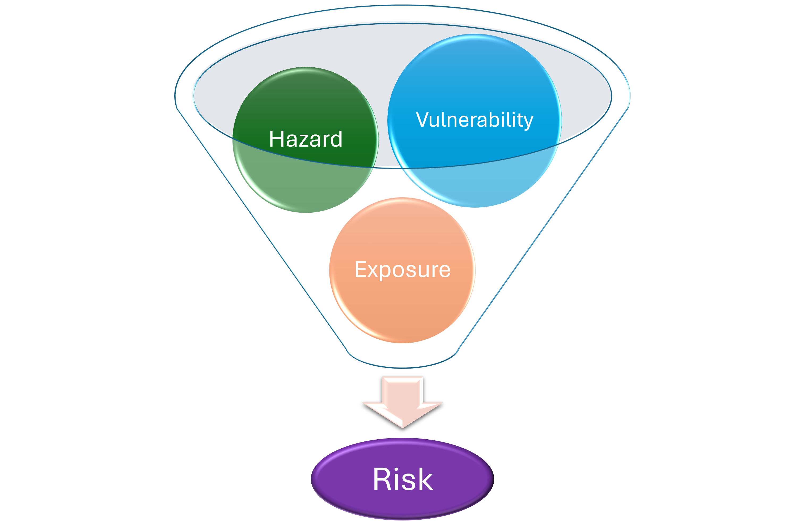

# Flood building damage and population exposed
## Workflow for risk assessment based on flood maps

Flooding, whether coastal, fluvial, or pluvial, is a major hazard to humans. This workflow aims at assessing how this hazard affects built-up areas by looking at economic damage represented by building damage, impact on critical infrastructures (such as hospitals, water tower, etc.), as well as the impact on the population by estimating the number of people exposed to the food hazard and the number of people displaced by it.
 
## Risk assessment methodology

### How is risk calculated?
The risks due to flooding are assessed in this workflow based on existing European-wide flood maps for river flooding, available for different return periods. The risk analysis is performed by estimating:
- Economic damage to buildings - using damage curves and building geometry/type.
- Exposed and displaced population - using a population distribution map.

The datasets used in this workflow by default are further described [below](#datasets-used-in-the-workflow). The datasets used in this workflow are European and Meditterenean-wide flood maps, global population datasets, and global datasets on buildigs. For producing results with higher accuracy, it is advisable to use local data when possible, this can be achieved by modifying the code to use other source datasets. 

```{note}
This workflow needs the following inputs:
- Hazard: Static flood maps for a flood event.
- Exposure: Buildings and population data.
- Vulnerabity: Damage curves for buildings and inundation depth thresholds for population displacement.
The outputs of this workflow are:
- Estimates of economic damage to buildings under the flood event.
- Estimates of displaced population.

```

### Which flood maps to use?

The flood maps used in this workflow by default are the “River flood hazard maps for Europe and the Mediterranean Basin region”, available from the [European Commission’s Joint Research Centre](https://data.jrc.ec.europa.eu/dataset/1d128b6c-a4ee-4858-9e34-6210707f3c81#description) - this is a European-wide flood map of flooding associated with rivers. The dataset includes flood maps for 9 different return periods ranging from 10 to 500 years. 

While the European-wide dataset can be useful for a first-order assessment, it has some important limitations: it only contains large river basins and does not include the impact of flood protection infrastructure. This dataset also does not include the effect of climate change. Please see the dedicated workflows for coastal and river flooding in the CLIMAAX workflows collection to learn more about the impact of climate change on the flood hazard. 

Given the limitations decribed above, using local data for flood maps may be necessary depending on the area of interest. The risk workflow methodology can be applied to any flood map of choice.

## Description of workflow 

### Structure of the workflow
This workflow consists of two parts: hazard assessment and risk assessment. In the next pages you will find:
1. **Hazard assessment** ([notebook on GitHub](Hazard_assessment_FLOOD_BUILDING_POPULATION.ipynb)) - explore the (river) flood maps with different return periods for the area of interest. 

2. **Risk assessment** ([notebook on GitHub](Risk_assessment_FLOOD_BUILDING_POPULATION.ipynb)) - explore the building damage, critical infrastructure impacted, population exposed and displaced for the area of interest under a give flood event (flood map). In this assessment, the potential risks due to flooding are estimated by combining the flood maps generated from different return periods with the damage curves, populations maps, and building data.


### Datasets used in the workflow 

The following datasets are used in this workflow:
- **Flood maps:** [“River flood hazard maps for Europe and the Mediterranean Basin region”](https://data.jrc.ec.europa.eu/dataset/1d128b6c-a4ee-4858-9e34-6210707f3c81#description) dataset, created by the Copernicus Emergency Management Service (Baugh et al., 2024), and available via the European Commission’s Joint Research Centre. The dataset maps flood water depths over return periods 10, 20, 50, 100, 200, and 500, at a resolution of 3 arc seconds, covering longitude -24.5° to 67.3°, and latitude 27.8° to 71.1°. 
- **Population density:** [GHS-POP R2023A](https://data.jrc.ec.europa.eu/dataset/2ff68a52-5b5b-4a22-8f40-c41da8332cfe) dataset (Schiavina et al., 2023), published by the European Commission’s Joint research Centre is used for mapping the population estimates or projections, with a resolution of 3 arc seconds and a global coverage. The workflow allows for selecting the population estimate in 5-year intervals between 1975 and 2020, or the population projection of either 2025 or 2030. 
- **Building data:** [OpenStreetMap](https://wiki.openstreetmap.org/wiki/Main_Page) is used to collect building information, both in terms of geometry and classification.


### Outputs of the workflow

For a specific area, this workflow outputs: 
- Flood depth maps for a specific return period (based on a European river flood map dataset). 
- Population distribution raster for a specific year. 
- Damage curves for buildings by class type. 
- Map of building type and class. 
- Building flood exposure maps. 
- Building damage maps and estimated annual building damage graph. 
- Critical infrastructure map combined with the flooded area. 
- Maps of exposed population and estimated annual exposed population graph. 
- Maps of displaced population and estimated annual displaced population graph. 

### References
Baugh et al. 2024
Schiavina et al., 2023

### Authors 
CMCC

Main contributors:  
...